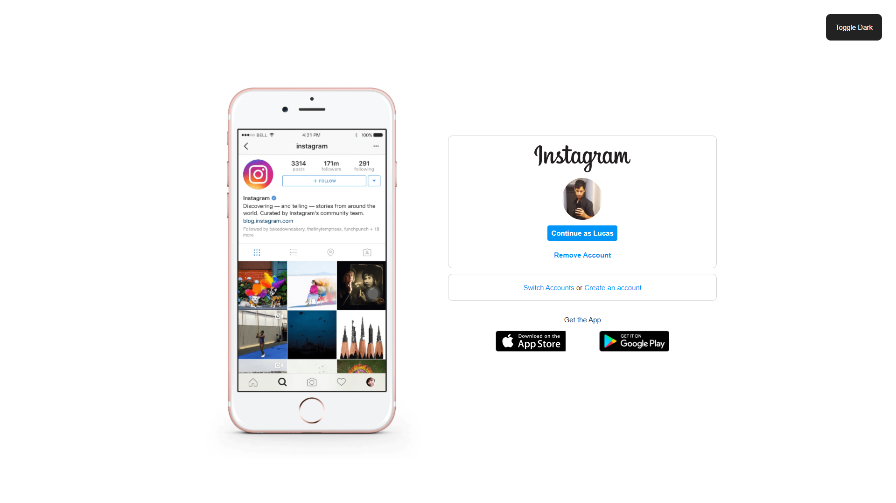
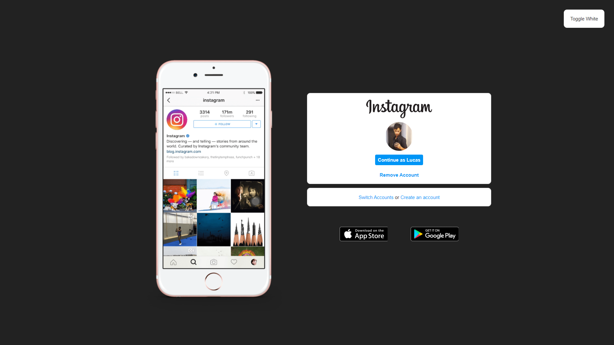

# Instagram-Login-Clone

An Instagram Login Page Clone with a Dark Mode Toggler






In your terminal if you have git installed run this:
```
git clone https://github.com/L-Goncalves/Instagram-Login-Clone.git
```

You won't need anything to run this, you can simply open index.html after cloning.
